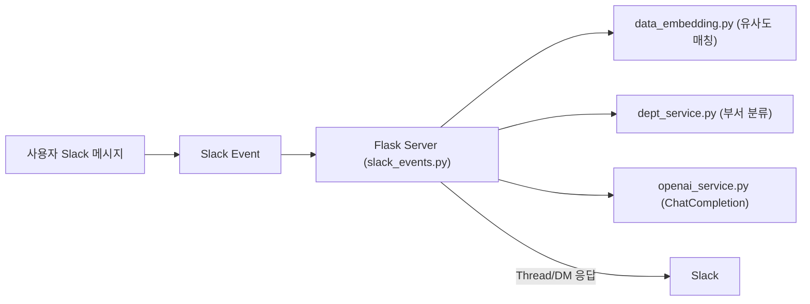

# SlackBot for Internal Q&A

> **사내 질문 자동 응답, 부서 분류, 담당자 DM 알림** 등을 지원하는 Slack Bot 프로젝트

## 목차
1. [프로젝트 개요](#프로젝트-개요)
2. [주요 기능](#주요-기능)
3. [아키텍처](#아키텍처)
4. [사용 예시 (Workflow)](#사용-예시(Workflow))
5. [설정 파일](#설정-파일)
6. [Threshold 기준](#threshold-기준)
7. [CI/CD (GitHub Actions + GCP)](#cicd-github-actions--gcp)

---

## 프로젝트 개요

이 SlackBot은 다음과 같은 목적을 가집니다:

- 사내 **데이터 기반** 자동 응답
- 사용자 문의를 **부서(카테고리) 분류**
- 분류 결과에 따라 **담당자 DM** 알림
- **버튼/모달**을 통한 추가 정보 입력 후 담당자에게 전달

**OpenAI**의 Embedding 및 ChatCompletion API를 활용하며, Slack Events API + Flask 서버로 구성되어 있습니다.

---

## 주요 기능

1. **데이터 매칭**  
   - OpenAI Embedding을 통해 사전에 준비된 데이터(질문/답변)와 사용자 입력을 비교  
   - 높은 유사도의 항목을 찾아 1차 응답

2. **부서 분류**  
   - 구글 시트에서 불러온 "부서 상세내용" 임베딩과 사용자 질문 임베딩을 비교  
   - Threshold(예: 0.7) 미만이면 "기타"로 분류

3. **자동 DM 전송**  
   - 분류된 부서 담당자(또는 관리자)에게 Slack DM 발송  
   - "기타"로 분류되면 봇은 채널에 댓글을 달지 않고 담당자에게만 DM

4. **버튼/모달로 추가 폼 입력**  
   - 카테고리별(예: 주차, 네트워크, 홈페이지) 액션 버튼 제공  
   - 버튼 클릭 시 모달창에서 정보 입력 → 담당자 DM 전송

---

## 아키텍처

1. Slack Event
  - 채널 또는 스레드에 메시지가 작성되면, Slack Events API가 Flask 서버로 전송
2. Flask 서버
  - 이벤트 수신 후 데이터 검색(search_similar_data) + 부서 분류(classify_by_detail)
3. OpenAI API
  - 임베딩(text-embedding-ada-002), ChatCompletion(gpt-4 등)
4. Slack 응답
  - 분류 결과에 따라 채널 스레드 답변 및 담당자 DM, 버튼/모달 제공

---

## 사용 예시(Workflow)

1. 사용자가 Slack 채널에서 “네트워크가 느려요”와 같은 문의를 남김

2. Slack Events API가 Flask 서버(slack_events.py)로 이벤트 전달

3. 임베딩 비교 : search_similar_data()로 해당 문의와 유사한 데이터 매칭

4. 부서 분류 : classify_by_detail() 결과, "네트워크" 카테고리로 분류

5. AI 응답: ChatCompletion으로 자동 답변을 생성해 스레드 댓글로 전송

6. 채널 스레드에는 추가 액션 버튼(“IP 고정 신청”, “사이트 장애 신고” 등) 표시

7. 버튼 클릭 시 모달창 뜨고, 사용자 입력 → 담당자 DM으로 폼 데이터 발송

--- 

## 설정 파일

- modules/config.py
  - 운영 환경에서는 GitHub Actions와 GCP Secret Manager에 저장된 민감 정보를 가져오도록 구성
  - 로컬 개발 환경에서는 .env 환경 변수로 설정
- 데이터 임베딩 파일
  - 예 : data/combined_slack_dcamp_embedding.json
  - 로컬에 저장된 사전 임베딩 데이터 (질문/답변)

---

## Threshold 기준

- 문의 데이터 매칭 (min_sim = 0.82)
  - 사내 문서가 짧은 편이라 약간만 유사해도 점수가 꽤 높게 나옴
  - 오탐을 줄이기 위해 0.82 이상에서만 실제 매칭으로 처리

- 부서 분류 (threshold = 0.7)
  - 부서별 상세내용이 광범위하므로 유사도가 0.7 정도면 동일 부서로 취급
  - 이 값 미만이면 “기타”로 분류해 담당자 DM만 전송

---

## CI/CD (GitHub Actions + GCP)

1. 브랜치 전략
  - 일반적으로 dev 브랜치에서 작업 후 main 브랜치로 머지(merge)하면,
  - GitHub Actions가 트리거되어 자동 빌드 & 배포를 수행합니다.

2. 시크릿 관리
  - GitHub Actions Secrets에 GCP 서비스 계정 전체 인증 정보(JSON 형식) 저장
  - GCP Secret Manager에 Slack 및 외부 연동용 시크릿 저장
     - 예: SLACK_BOT_TOKEN, SLACK_SIGNING_SECRET, VERIFICATION_TOKEN, OPENAI_API_KEY, GOOGLE_APPS_SCRIPT_URL, SECRET_TOKEN 등
  - .env 파일은 Git Repo에 포함되지 않으며, 로컬 개발용으로만 사용, 운영환경은 모두 시크릿으로 관리

3. 배포 프로세스
   - Checkout: 소스 코드 가져오기
   - Python 테스트 & 린트
   - Docker 빌드: Cloud Run용 컨테이너 이미지 생성
   - 배포: GCP(Cloud Run 등)에 이미지 배포 → 최신 코드가 반영됨

4 .운영 환경
  - Cloud Run(또는 Compute Engine, GKE 등)에서 Flask 앱 실행
  - Secret Manager와 연동해 환경 변수를 주입
  - Slack Events API가 배포된 서비스 URL을 통해 이벤트를 전달

---

